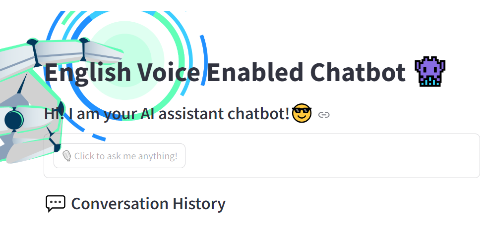

# English-Voice-Enabled-Chatbot

**Description:**

This is a Streamlit voice-enabled chatbot application using 'Wav2Vec2' model from HuggingFace library and Gemini 1.5 Pro.

1. Clone the repo. Create virtual environment with python=3.10
 conda create -n chatbot python=3.10 -y

2. Set HUGGINGFACE_API_KEY and GOOGLE_API_KEY in .env file
3. pip install -r requirements.txt
4. streamlit run app.py